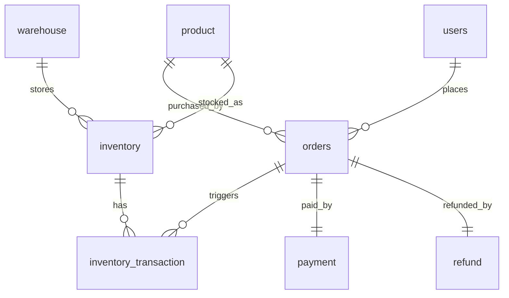
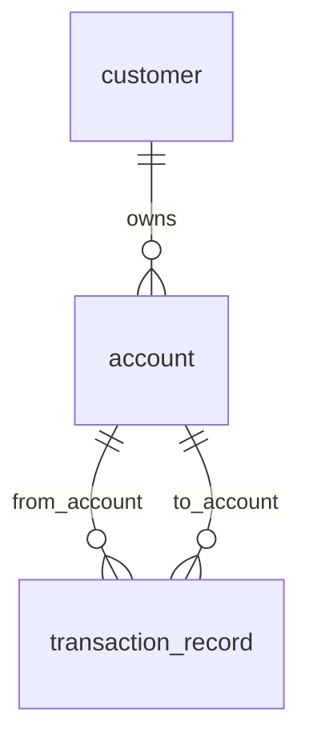
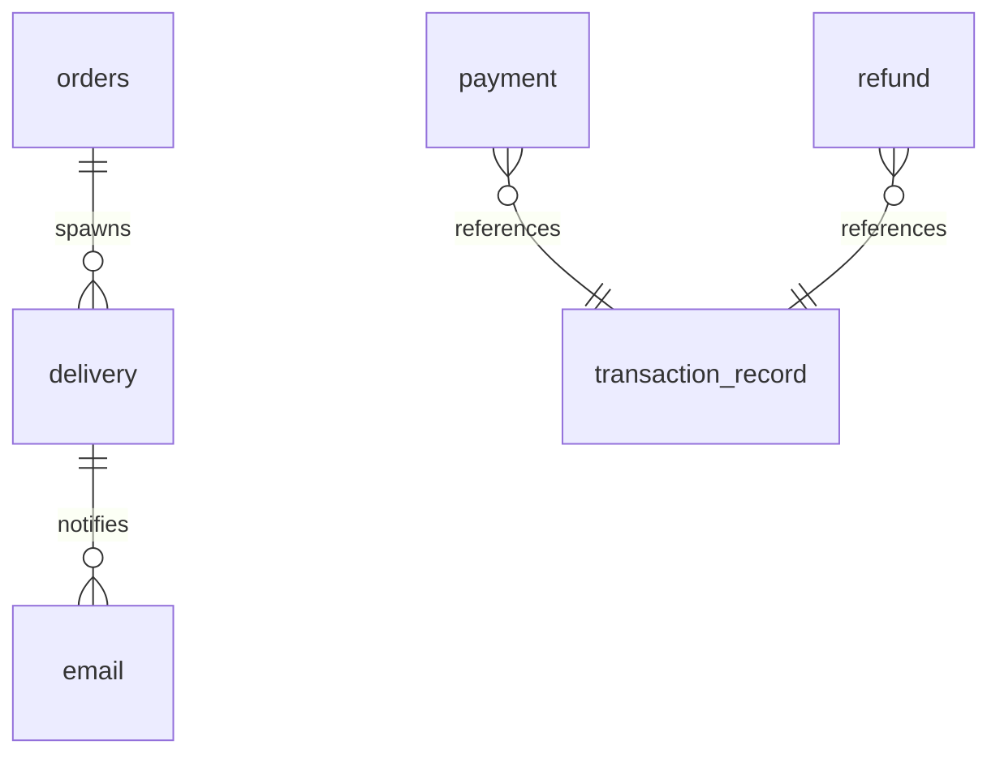

# Database Structure（数据库结构文档）

> 生成依据：本仓库当前代码中的 JPA Entity（`@Entity`）定义与各服务 `application.properties` 的数据源配置。  
> 建表方式：所有 Spring Boot 服务均配置 `spring.jpa.hibernate.ddl-auto=create`，因此数据库表结构会在服务启动时由 Hibernate 自动创建（每次启动会 drop & recreate）。

## 1. 总览：服务、数据库与归属表

本项目由 4 个独立的 Spring Boot 服务组成，每个服务连接各自独立的 PostgreSQL 数据库（没有跨库外键）。

| 服务 | 端口（默认） | PostgreSQL 数据库（默认） | 归属数据表（由该服务创建/维护） |
|---|---:|---|---|
| `store_application` | `8080` | `comp5348_assignment_2` | `users`, `orders`, `product`, `warehouse`, `inventory`, `inventory_transaction`, `payment`, `refund` |
| `bank_application` | `8081` | `bank_application` | `customer`, `account`, `transaction_record`（以及可能的 `hibernate_sequence` 等序列对象） |
| `delivery_application` | `8082` | `delivery_application` | `delivery` |
| `email_application` | `8083` | `email_application` | `email` |

数据源配置文件：
- `store_application/src/main/resources/application.properties`
- `bank_application/src/main/resources/application.properties`
- `delivery_application/src/main/resources/application.properties`
- `email_application/src/main/resources/application.properties`

## 2. 映射/命名约定（重要）

### 2.1 表名/列名

- 显式表名：如果实体类使用 `@Table(name="...")`，则以该表名为准（例如 `users`、`orders`）。
- 默认表名：若未标注 `@Table`，表名通常由实体类名推导，并按 Spring Boot / Hibernate 的默认命名策略将驼峰转为下划线（例如 `InventoryTransaction` → `inventory_transaction`，`TransactionRecord` → `transaction_record`）。
- 默认列名：同理，字段名会按命名策略推导为列名（例如 `firstName` → `first_name`，`passwordHash` → `password_hash`）。

> 说明：如果后续显式配置了 `spring.jpa.hibernate.naming.*`（自定义命名策略），实际表名/列名可能与本文档略有差异。

### 2.2 主键与乐观锁

- 各表均以 `id`（`long`）作为主键。
- 多数实体包含 `@Version` 字段 `version`（`int`），用于 JPA 乐观锁。

### 2.3 枚举（Enum）落库方式

本项目中的枚举字段未显式标注 `@Enumerated(EnumType.STRING)`，因此 **默认以 `ORDINAL`（整数序号）方式存储**（通常落为 `integer`，从 `0` 开始按枚举声明顺序递增）。

这意味着：
- 新增/调整枚举值顺序可能造成历史数据语义错乱。
- 若希望更安全/可读，建议后续统一改为 `EnumType.STRING` 并进行迁移（本次仅做文档说明，不改代码）。

## 3. Store Application（`store_application`）数据库结构

数据库：`comp5348_assignment_2`  
实体来源目录：`store_application/src/main/java/com/comp5348/practice9/group5/store/model`

### 3.1 表：`users`（用户）

对应实体：`store_application/src/main/java/com/comp5348/practice9/group5/store/model/User.java`

| 列 | 类型（PostgreSQL） | 允许为空 | 约束/键 | 说明 |
|---|---|---:|---|---|
| `id` | `bigint`（IDENTITY） | 否 | PK | 用户主键 |
| `version` | `integer` | 否 |  | 乐观锁版本号 |
| `first_name` | `varchar(255)` | 否 |  | 名 |
| `last_name` | `varchar(255)` | 否 |  | 姓 |
| `email` | `varchar(255)` | 否 |  | 邮箱（当前未加唯一约束） |
| `password_hash` | `varchar(255)` | 否 |  | 密码哈希 |

关系：
- `users (1) -> (N) orders`：一个用户可创建多个订单（外键在 `orders.user_id`）。

### 3.2 表：`product`（商品）

对应实体：`store_application/src/main/java/com/comp5348/practice9/group5/store/model/Product.java`

| 列 | 类型（PostgreSQL） | 允许为空 | 约束/键 | 说明 |
|---|---|---:|---|---|
| `id` | `bigint`（IDENTITY） | 否 | PK | 商品主键 |
| `version` | `integer` | 否 |  | 乐观锁版本号 |
| `name` | `varchar(255)` | 否 |  | 商品名 |
| `description` | `varchar(255)` | 否 |  | 商品描述 |
| `price` | `double precision` | 否 |  | 单价 |

关系：
- `product (1) -> (N) orders`：一个商品可被多个订单购买（外键在 `orders.product_id`）。
- `product (1) -> (N) inventory`：一个商品可在多个仓库有库存（外键在 `inventory.product_id`）。

### 3.3 表：`warehouse`（仓库）

对应实体：`store_application/src/main/java/com/comp5348/practice9/group5/store/model/Warehouse.java`

| 列 | 类型（PostgreSQL） | 允许为空 | 约束/键 | 说明 |
|---|---|---:|---|---|
| `id` | `bigint`（IDENTITY） | 否 | PK | 仓库主键 |
| `version` | `integer` | 否 |  | 乐观锁版本号 |
| `name` | `varchar(255)` | 否 |  | 仓库名称 |
| `address` | `varchar(255)` | 否 |  | 仓库地址 |

关系：
- `warehouse (1) -> (N) inventory`：一个仓库包含多条库存记录（外键在 `inventory.warehouse_id`）。

### 3.4 表：`inventory`（库存）

对应实体：`store_application/src/main/java/com/comp5348/practice9/group5/store/model/Inventory.java`

| 列 | 类型（PostgreSQL） | 允许为空 | 约束/键 | 说明 |
|---|---|---:|---|---|
| `id` | `bigint`（IDENTITY） | 否 | PK | 库存记录主键 |
| `version` | `integer` | 否 |  | 乐观锁版本号 |
| `quantity` | `integer` | 否 |  | 当前库存数量 |
| `product_id` | `bigint` | 否 | FK → `product.id` | 对应商品 |
| `warehouse_id` | `bigint` | 否 | FK → `warehouse.id` | 对应仓库 |

关系：
- `product (1) -> (N) inventory`
- `warehouse (1) -> (N) inventory`
- `inventory (1) -> (N) inventory_transaction`（外键在 `inventory_transaction.inventory_id`）

### 3.5 表：`orders`（订单）

对应实体：`store_application/src/main/java/com/comp5348/practice9/group5/store/model/Order.java`

| 列 | 类型（PostgreSQL） | 允许为空 | 约束/键 | 说明 |
|---|---|---:|---|---|
| `id` | `bigint`（IDENTITY） | 否 | PK | 订单主键 |
| `version` | `integer` | 否 |  | 乐观锁版本号 |
| `timestamp` | `timestamp` | 否 |  | 下单时间（`java.util.Date` + `@Temporal(TIMESTAMP)`） |
| `quantity` | `integer` | 否 |  | 购买数量（应用层有 `@Min(1)` 校验；是否生成 DB CHECK 取决于 Hibernate Validator 配置） |
| `amount` | `double precision` | 否 |  | 订单金额（在构造器中以 `product.price * quantity` 计算） |
| `order_status` | `integer` | 否 |  | 订单状态（`OrderStatus`，按枚举序号存储） |
| `delivery_status` | `integer` | 否 |  | 配送状态（`DeliveryStatus`，按枚举序号存储） |
| `user_id` | `bigint` | 否 | FK → `users.id` | 下单用户 |
| `product_id` | `bigint` | 否 | FK → `product.id` | 购买商品 |

关系：
- `users (1) -> (N) orders`
- `product (1) -> (N) orders`
- `orders (1) -> (N) inventory_transaction`（外键在 `inventory_transaction.order_id`）
- `orders (1) -> (1) payment`（外键在 `payment.order_id`，通常会带 UNIQUE 约束以保证一对一）
- `orders (1) -> (1) refund`（外键在 `refund.order_id`，通常会带 UNIQUE 约束以保证一对一；业务上可能为可选关系）

### 3.6 表：`inventory_transaction`（库存事务/流水）

对应实体：`store_application/src/main/java/com/comp5348/practice9/group5/store/model/InventoryTransaction.java`

| 列 | 类型（PostgreSQL） | 允许为空 | 约束/键 | 说明 |
|---|---|---:|---|---|
| `id` | `bigint`（IDENTITY） | 否 | PK | 库存事务主键 |
| `version` | `integer` | 否 |  | 乐观锁版本号 |
| `quantity` | `integer` | 否 |  | 本次出入库数量 |
| `status` | `integer` | 否 |  | 事务状态（`InventoryStatus`，按枚举序号存储） |
| `inventory_id` | `bigint` | 否 | FK → `inventory.id` | 对应库存记录 |
| `order_id` | `bigint` | 否 | FK → `orders.id` | 对应订单 |

关系：
- `inventory (1) -> (N) inventory_transaction`
- `orders (1) -> (N) inventory_transaction`

### 3.7 表：`payment`（支付）

对应实体：`store_application/src/main/java/com/comp5348/practice9/group5/store/model/Payment.java`

| 列 | 类型（PostgreSQL） | 允许为空 | 约束/键 | 说明 |
|---|---|---:|---|---|
| `id` | `bigint`（IDENTITY） | 否 | PK | 支付主键 |
| `version` | `integer` | 否 |  | 乐观锁版本号 |
| `amount` | `double precision` | 否 |  | 支付金额 |
| `payment_status` | `integer` | 否 |  | 支付状态（`PaymentStatus`，按枚举序号存储） |
| `order_id` | `bigint` | 否 | FK → `orders.id`（UNIQUE） | 对应订单（一对一） |
| `transaction_record_id` | `bigint` | 否 |  | 对应银行交易流水 ID（跨服务引用，见第 6 节） |
| `from_account_id` | `bigint` | 否 |  | 付款账户 ID（跨服务引用，见第 6 节） |

关系：
- `orders (1) -> (1) payment`（数据库层通常通过 `payment.order_id` 的 UNIQUE 约束实现一对一）

### 3.8 表：`refund`（退款）

对应实体：`store_application/src/main/java/com/comp5348/practice9/group5/store/model/Refund.java`

| 列 | 类型（PostgreSQL） | 允许为空 | 约束/键 | 说明 |
|---|---|---:|---|---|
| `id` | `bigint`（IDENTITY） | 否 | PK | 退款主键 |
| `version` | `integer` | 否 |  | 乐观锁版本号 |
| `amount` | `double precision` | 否 |  | 退款金额 |
| `order_id` | `bigint` | 否 | FK → `orders.id`（UNIQUE） | 对应订单（一对一） |
| `transaction_record_id` | `bigint` | 否 |  | 对应银行交易流水 ID（跨服务引用，见第 6 节） |

关系：
- `orders (1) -> (0..1) refund`（实体上是一对一；是否“必有退款”取决于业务流程）

### 3.9 Store 侧枚举值（供理解状态字段）

来源：
- `store_application/src/main/java/com/comp5348/practice9/group5/store/model/OrderStatus.java`
- `store_application/src/main/java/com/comp5348/practice9/group5/store/model/PaymentStatus.java`
- `store_application/src/main/java/com/comp5348/practice9/group5/store/model/InventoryStatus.java`
- `store_application/src/main/java/com/comp5348/practice9/group5/store/model/DeliveryStatus.java`

- `OrderStatus`：`PENDING`, `PROCESSING`, `COMPLETED`, `CANCELLED`, `REFUNDED`
- `PaymentStatus`：`PAID`, `REFUNDED`
- `InventoryStatus`：`DISPATCHED`, `RECEIVED`
- `DeliveryStatus`：`EMPTY`, `SETUP`, `PICKUP`, `DELIVERING`, `COMPLETED`, `CANCELLED`

## 4. Bank Application（`bank_application`）数据库结构

数据库：`bank_application`  
实体来源目录：`bank_application/src/main/java/com/comp5348/bank/model`

> 注意：本服务实体的 `@GeneratedValue` 未指定 `strategy`，默认通常为 `AUTO`。在 PostgreSQL + Hibernate 下常见实现是创建并使用一个序列（例如 `hibernate_sequence`）。实际生成方式可能随 Hibernate 配置变化。

### 4.1 表：`customer`（客户）

对应实体：`bank_application/src/main/java/com/comp5348/bank/model/Customer.java`

| 列 | 类型（PostgreSQL） | 允许为空 | 约束/键 | 说明 |
|---|---|---:|---|---|
| `id` | `bigint`（序列/自动生成） | 否 | PK | 客户主键 |
| `version` | `integer` | 否 |  | 乐观锁版本号 |
| `first_name` | `varchar(255)` | 否 |  | 名 |
| `last_name` | `varchar(255)` | 否 |  | 姓 |

关系：
- `customer (1) -> (N) account`（外键在 `account.customer_id`）

### 4.2 表：`account`（账户）

对应实体：`bank_application/src/main/java/com/comp5348/bank/model/Account.java`

| 列 | 类型（PostgreSQL） | 允许为空 | 约束/键 | 说明 |
|---|---|---:|---|---|
| `id` | `bigint`（序列/自动生成） | 否 | PK | 账户主键 |
| `customer_id` | `bigint` | 否 | FK → `customer.id` | 账户归属客户 |
| `version` | `integer` | 否 |  | 乐观锁版本号 |
| `name` | `varchar(255)` | 否 |  | 账户名称 |
| `balance` | `double precision` | 否 |  | 余额（Java 侧默认 `0.0`，数据库层未显式设置默认值） |

关系：
- `customer (1) -> (N) account`
- `account (1) -> (N) transaction_record`（作为 `from_account` 或 `to_account`）

### 4.3 表：`transaction_record`（交易流水）

对应实体：`bank_application/src/main/java/com/comp5348/bank/model/TransactionRecord.java`

| 列 | 类型（PostgreSQL） | 允许为空 | 约束/键 | 说明 |
|---|---|---:|---|---|
| `id` | `bigint`（序列/自动生成） | 否 | PK | 交易主键 |
| `amount` | `double precision` | 否 |  | 金额 |
| `memo` | `varchar(255)` | 是 |  | 备注 |
| `time` | `timestamp` | 否 |  | 交易时间（`java.time.LocalDateTime`） |
| `to_account_id` | `bigint` | 是 | FK → `account.id` | 收款账户（可空，用于提现等场景） |
| `from_account_id` | `bigint` | 是 | FK → `account.id` | 付款账户（可空，用于入金等场景） |
| `version` | `integer` | 否 |  | 乐观锁版本号 |

关系（同一张表对 `account` 有两条外键）：
- `account (1) -> (N) transaction_record` via `from_account_id`
- `account (1) -> (N) transaction_record` via `to_account_id`

## 5. Delivery Application（`delivery_application`）数据库结构

数据库：`delivery_application`  
实体来源目录：`delivery_application/src/main/java/com/example/delivery_application/model`

### 5.1 表：`delivery`（配送任务）

对应实体：`delivery_application/src/main/java/com/example/delivery_application/model/Delivery.java`

| 列 | 类型（PostgreSQL） | 允许为空 | 约束/键 | 说明 |
|---|---|---:|---|---|
| `id` | `bigint`（IDENTITY） | 否 | PK | 配送主键 |
| `version` | `integer` | 否 |  | 乐观锁版本号 |
| `order_id` | `bigint` | 否 |  | 对应订单 ID（跨服务引用：`store_application.orders.id`，数据库层不建外键） |
| `status` | `integer` | 否 |  | 配送状态（`DeliveryStatus`，按枚举序号存储） |
| `timestamp` | `timestamp` | 否 |  | 时间戳 |
| `quantity` | `integer` | 否 |  | 数量（与订单数量语义一致） |
| `address` | `varchar(255)` | 否 |  | 配送地址 |
| `email` | `varchar(255)` | 否 |  | 用户邮箱 |

Delivery 侧枚举：
- `delivery_application/src/main/java/com/example/delivery_application/model/DeliveryStatus.java`
- 值：`EMPTY`, `SETUP`, `PICKUP`, `DELIVERING`, `COMPLETED`, `CANCELLED`

## 6. Email Application（`email_application`）数据库结构

数据库：`email_application`  
实体来源目录：`email_application/src/main/java/com/example/email_application/model`

### 6.1 表：`email`（邮件记录/通知）

对应实体：`email_application/src/main/java/com/example/email_application/model/Email.java`

| 列 | 类型（PostgreSQL） | 允许为空 | 约束/键 | 说明 |
|---|---|---:|---|---|
| `id` | `bigint`（IDENTITY） | 否 | PK | 邮件记录主键 |
| `version` | `integer` | 否 |  | 乐观锁版本号 |
| `delivery_id` | `bigint` | 否 |  | 对应配送 ID（跨服务引用：`delivery_application.delivery.id`，数据库层不建外键） |
| `email_address` | `varchar(255)` | 否 |  | 收件人邮箱 |
| `description` | `varchar(255)` | 否 |  | 邮件内容/描述 |
| `timestamp` | `timestamp` | 否 |  | 时间戳 |
| `status` | `integer` | 否 |  | 配送状态（`DeliveryStatus`，按枚举序号存储） |
| `address` | `varchar(255)` | 否 |  | 配送地址（用于邮件内容/追踪） |

Email 侧枚举：
- `email_application/src/main/java/com/example/email_application/model/DeliveryStatus.java`
- 值：`EMPTY`, `SETUP`, `PICKUP`, `DELIVERING`, `COMPLETED`, `CANCELLED`

## 7. 跨服务数据关系（无数据库外键约束）

由于各服务使用不同数据库，以下“关系”仅通过字段值（ID）进行关联，**数据库层不会创建跨库外键**；一致性由服务间调用/消息驱动流程保证。

| 来源（表.列） | 逻辑指向 | 关系含义 | 约束方式 |
|---|---|---|---|
| `delivery.order_id` | `store_application.orders.id` | 配送任务关联某个订单 | 应用逻辑保证（无 FK/UNIQUE） |
| `email.delivery_id` | `delivery_application.delivery.id` | 邮件记录关联某个配送任务 | 应用逻辑保证（无 FK/UNIQUE） |
| `payment.transaction_record_id` | `bank_application.transaction_record.id` | 支付对应的银行交易流水 | 仅存 ID 解耦银行服务 |
| `payment.from_account_id` | `bank_application.account.id` | 支付扣款账户 | 仅存 ID 解耦银行服务 |
| `refund.transaction_record_id` | `bank_application.transaction_record.id` | 退款对应的银行交易流水 | 仅存 ID 解耦银行服务 |

### 7.1 状态枚举的“跨服务一致性”

`DeliveryStatus` 在 `store_application`、`delivery_application`、`email_application` 中各自定义了一份（值列表一致）。  
因为它们会通过 API/消息在服务间传递语义，建议长期保持枚举值与顺序一致（尤其当前按 `ORDINAL` 落库）。

## 8. 关系图（按服务）

### 8.1 Store Application ER（同库可用外键约束）

### 8.2 Bank Application ER（同库可用外键约束）

### 8.3 跨服务关系（仅逻辑关联，无数据库外键）

