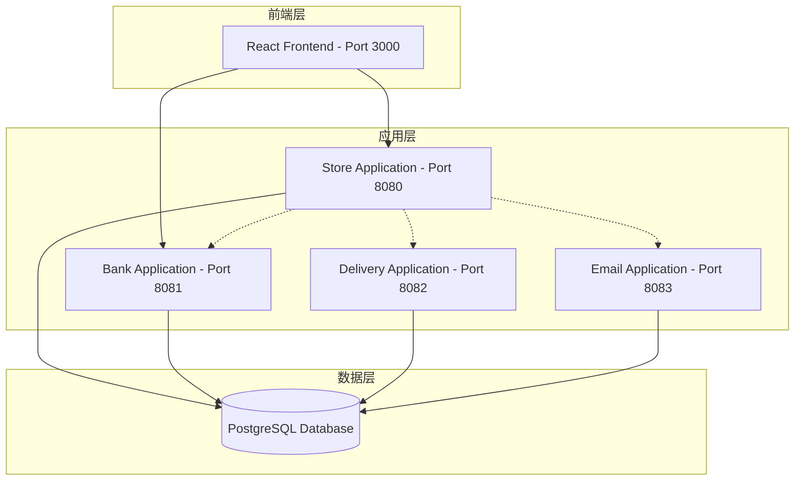
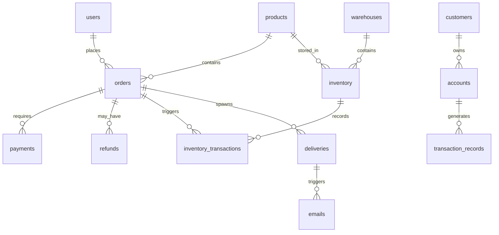

# COMP5348 项目代码库结构

## 项目概述

这是一个多模块的分布式电子商务系统，包含四个独立的Spring Boot后端应用和一个React前端应用。每个应用运行在独立的端口，通过REST API进行通信。

## 系统架构图



## 模块详细说明

### 1. Store Application (端口 8080)
**包路径**: `com.comp5348.practice9.group5.store`

**控制器层**:
- [`InventoryController`](store_application/src/main/java/com/comp5348/practice9/group5/store/controller/InventoryController.java) - 库存管理
- [`OrderController`](store_application/src/main/java/com/comp5348/practice9/group5/store/controller/OrderController.java) - 订单处理
- [`PaymentController`](store_application/src/main/java/com/comp5348/practice9/group5/store/controller/PaymentController.java) - 支付管理
- [`ProductController`](store_application/src/main/java/com/comp5348/practice9/group5/store/controller/ProductController.java) - 商品管理
- [`UserController`](store_application/src/main/java/com/comp5348/practice9/group5/store/controller/UserController.java) - 用户管理
- [`WarehouseController`](store_application/src/main/java/com/comp5348/practice9/group5/store/controller/WarehouseController.java) - 仓库管理

**主要模型**:
- [`User`](store_application/src/main/java/com/comp5348/practice9/group5/store/model/User.java) - 用户实体
- [`Product`](store_application/src/main/java/com/comp5348/practice9/group5/store/model/Product.java) - 商品实体
- [`Order`](store_application/src/main/java/com/comp5348/practice9/group5/store/model/Order.java) - 订单实体
- [`Payment`](store_application/src/main/java/com/comp5348/practice9/group5/store/model/Payment.java) - 支付实体
- [`Inventory`](store_application/src/main/java/com/comp5348/practice9/group5/store/model/Inventory.java) - 库存实体
- [`Warehouse`](store_application/src/main/java/com/comp5348/practice9/group5/store/model/Warehouse.java) - 仓库实体

### 2. Bank Application (端口 8081)
**包路径**: `com.comp5348.bank`

**控制器层**:
- [`AccountController`](bank_application/src/main/java/com/comp5348/bank/controller/AccountController.java) - 账户管理
- [`CustomerController`](bank_application/src/main/java/com/comp5348/bank/controller/CustomerController.java) - 客户管理
- [`TransactionRecordController`](bank_application/src/main/java/com/comp5348/bank/controller/TransactionRecordController.java) - 交易记录

**主要模型**:
- [`Customer`](bank_application/src/main/java/com/comp5348/bank/model/Customer.java) - 银行客户
- [`Account`](bank_application/src/main/java/com/comp5348/bank/model/Account.java) - 银行账户
- [`TransactionRecord`](bank_application/src/main/java/com/comp5348/bank/model/TransactionRecord.java) - 交易记录

### 3. Delivery Application (端口 8082)
**包路径**: `com.example.delivery_application`

**控制器层**:
- [`DeliveryController`](delivery_application/src/main/java/com/example/delivery_application/controller/DeliveryController.java) - 配送管理

**主要模型**:
- [`Delivery`](delivery_application/src/main/java/com/example/delivery_application/model/Delivery.java) - 配送实体

### 4. Email Application (端口 8083)
**包路径**: `com.example.email_application`

**控制器层**:
- [`EmailController`](email_application/src/main/java/com/example/email_application/controller/EmailController.java) - 邮件管理

**主要模型**:
- [`Email`](email_application/src/main/java/com/example/email_application/model/Email.java) - 邮件实体

### 5. Frontend Application (端口 3000)
**技术栈**: React 18.3.1

**主要页面**:
- [`Login`](store-app-frontend/src/pages/auth/Login/Login.js) - 登录页面
- [`Register`](store-app-frontend/src/pages/auth/Register/Register.js) - 注册页面
- [`Product`](store-app-frontend/src/pages/product/product.js) - 商品页面
- [`Order List`](store-app-frontend/src/pages/order/order_list.js) - 订单列表
- [`Order Info`](store-app-frontend/src/pages/order/order_info.js) - 订单详情
- [`Payment Info`](store-app-frontend/src/pages/payment/payment_info.js) - 支付信息
- [`User Profile`](store-app-frontend/src/pages/user/profile.js) - 用户资料

**服务层**:
- [`order.service.js`](store-app-frontend/src/services/order.service.js) - 订单服务
- [`payment.service.js`](store-app-frontend/src/services/payment.service.js) - 支付服务
- [`product.service.js`](store-app-frontend/src/services/product.service.js) - 商品服务
- [`user.service.js`](store-app-frontend/src/services/user.service.js) - 用户服务

## 数据库关系

系统使用PostgreSQL数据库，主要表关系如下：



## 跨应用通信

应用程序间通过以下方式进行通信：

1. **REST API调用**: 前端通过HTTP请求与各个后端服务通信
2. **数据库引用**: 不同应用通过共享数据库中的外键进行间接关联
3. **服务间调用**: 应用通过HTTP客户端调用其他服务（如[`BankConfig`](store_application/src/main/java/com/comp5348/practice9/group5/store/util/BankConfig.java)）

## 技术栈

- **后端**: Spring Boot, Gradle, JPA/Hibernate
- **前端**: React, Axios, React Router
- **数据库**: PostgreSQL
- **构建工具**: Gradle (后端), npm (前端)
- **Java版本**: 8

## 运行配置

每个应用需要配置PostgreSQL连接信息：

```properties
spring.datasource.url=jdbc:postgresql://localhost:5432/<database-name>
spring.datasource.username=<username>
spring.datasource.password=<password>
spring.jpa.hibernate.ddl-auto=update
spring.jpa.show-sql=true
```

## 测试凭据

- **用户名**: customer
- **密码**: COMP5348