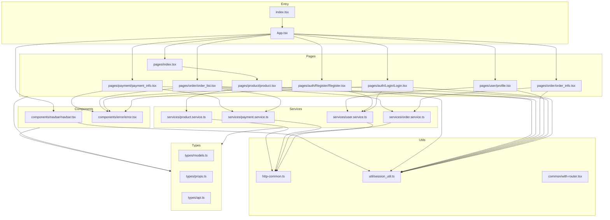

# Store App Frontend - JavaScript to TypeScript 迁移分析报告

## 1. 项目概述

本报告分析了 `store-app-frontend` JavaScript React 项目的结构，为迁移到 TypeScript 提供详细的参考依据。

---

## 2. 依赖项分析

### 2.1 当前 Dependencies

|包名 | 版本 | 用途 | 需要的 @types 包 |
|------|------|------|------------------|
| react | ^18.3.1 | React 核心库 | @types/react |
| react-dom | ^18.3.1 | React DOM 渲染 | @types/react-dom |
| react-router-dom | ^6.27.0 | 路由管理 | 内置类型 |
| axios | ^1.7.7 | HTTP 客户端 | 内置类型 |
| js-cookie | ^3.0.5 | Cookie 操作 | @types/js-cookie |
| web-vitals | ^2.1.4 | 性能监控 | 内置类型 |
| @testing-library/jest-dom | ^5.17.0 | Jest DOM匹配器 | @types/testing-library__jest-dom |
| @testing-library/react | ^13.4.0 | React 测试工具 | 内置类型 |
| @testing-library/user-event | ^13.5.0 | 用户事件模拟 | 内置类型 |
| react-scripts | 5.0.1 | CRA 脚本 | 不需要 |

### 2.2 当前 DevDependencies

| 包名 | 版本 | 用途 |
|------|------|------|
| tailwindcss | ^3.4.14 | CSS 框架 |

### 2.3 TypeScript 迁移需要添加的依赖

```json
{
  "devDependencies": {
    "typescript": "^5.3.0",
    "@types/react": "^18.2.0",
    "@types/react-dom": "^18.2.0",
    "@types/js-cookie": "^3.0.6",
    "@types/node": "^20.0.0"
  }
}
```

---

## 3. 项目文件结构

### 3.1 完整文件清单

```
store-app-frontend/
├── public/
│   ├── favicon.ico
│   ├── index.html
│   ├── logo192.png
│   ├── logo512.png
│   ├── manifest.json
│   └── robots.txt
├── src/
│   ├── common/
│   │   └── with-router.js→ with-router.tsx
│   ├── components/
│   │   ├── error/
│   │   │   └── error.js→ error.tsx
│   │   └── navbar/
│   │       └── navbar.js           → navbar.tsx
│   ├── pages/
│   │   ├── auth/
│   │   │   ├── Login/
│   │   │   │   └── Login.js        → Login.tsx
│   │   │   └── Register/
│   │   │       └── Register.js     → Register.tsx
│   │   ├── order/
│   │   │   ├── order_info.js       → order_info.tsx
│   │   │   └── order_list.js       → order_list.tsx
│   │   ├── payment/
│   │   │   └── payment_info.js     → payment_info.tsx
│   │   ├── product/
│   │   │   └── product.js          → product.tsx
│   │   ├── user/
│   │   │   └── profile.js          → profile.tsx
│   │   └── index.js                → index.tsx
│   ├── services/
│   │   ├── order.service.js→ order.service.ts
│   │   ├── payment.service.js      → payment.service.ts
│   │   ├── product.service.js      → product.service.ts
│   │   └── user.service.js         → user.service.ts
│   ├── util/
│   │   └── session_util.js         → session_util.ts
│   ├── App.css
│   ├── App.js→ App.tsx
│   ├── App.test.js                 → App.test.tsx
│   ├── http-common.js              → http-common.ts
│   ├── index.css
│   ├── index.js                    → index.tsx
│├── logo.svg
│   ├── reportWebVitals.js          → reportWebVitals.ts
│   ├── setupTests.js               → setupTests.ts
│   └── test.js                     → test.ts (空文件，可删除)
├── package.json
├── package-lock.json
├── tailwind.config.js              → tailwind.config.js (保持不变)
└── README.md
```

---

## 4. 文件详细分析

### 4.1 入口文件

#### `src/index.js` → `src/index.tsx`
- **用途**: 应用入口点，渲染根组件
- **依赖**: react, react-dom, react-router-dom, App, reportWebVitals
- **迁移注意**: 需要添加 React 18 的类型声明

#### `src/App.js` → `src/App.tsx`
- **用途**: 主应用组件，定义路由配置
- **类型**: Class Component
- **路由**: 7 个路由 (/, /login, /register, /profile, /order-info, /payment-info, /order-list)
- **迁移建议**: 考虑转换为函数组件

### 4.2 配置文件

#### `src/http-common.js` → `src/http-common.ts`
- **用途**: Axios 实例配置
- **配置**: baseURL: "http://127.0.0.1:8080"
- **需要类型**: AxiosInstance

### 4.3 工具函数

#### `src/common/with-router.js` → `src/common/with-router.tsx`
- **用途**: 高阶组件，为类组件提供路由 props
- **需要类型**: 泛型 HOC 类型定义

#### `src/util/session_util.js` → `src/util/session_util.ts`
- **用途**: SessionStorage 操作工具
- **函数**:
  - `setSessionData(key, value)` - 存储数据
  - `getSessionData(key)` - 获取数据
  - `clearSessionData(key)` - 清除指定数据
  - `clearAllSessionData()` - 清除所有数据
- **需要类型**: 泛型函数类型

### 4.4 组件文件

#### `src/components/navbar/navbar.js` → `src/components/navbar/navbar.tsx`
- **用途**: 导航栏组件
- **类型**: 函数组件
- **状态**: isOpen (boolean)
- **依赖**: js-cookie, session_util

#### `src/components/error/error.js` → `src/components/error/error.tsx`
- **用途**: 错误消息提示组件
- **类型**: 函数组件
- **Props**: message (string), onClose (function)
- **需要类型**: ErrorMessageProps interface

### 4.5 页面组件

#### `src/pages/index.js` → `src/pages/index.tsx`
- **用途**: 首页，展示产品列表
- **类型**: 函数组件

#### `src/pages/auth/Login/Login.js` → `src/pages/auth/Login/Login.tsx`
- **用途**: 登录页面
- **类型**: 函数组件
- **状态**: formData, error
- **需要类型**: LoginFormData interface

#### `src/pages/auth/Register/Register.js` → `src/pages/auth/Register/Register.tsx`
- **用途**: 注册页面
- **类型**: 函数组件
- **状态**: formData, error
- **需要类型**: RegisterFormData interface

#### `src/pages/user/profile.js` → `src/pages/user/profile.tsx`
- **用途**: 用户资料页面
- **类型**: 函数组件
- **状态**: formData, error
- **需要类型**: UserProfileFormData interface

#### `src/pages/order/order_info.js` → `src/pages/order/order_info.tsx`
- **用途**: 订单信息页面
- **类型**: 函数组件
- **路由状态**: productId, name, price, quantity, description
- **需要类型**: OrderInfoState interface

#### `src/pages/order/order_list.js` → `src/pages/order/order_list.tsx`
- **用途**: 订单列表页面
- **类型**: 函数组件
- **状态**: orders, loading, error
- **需要类型**: Order interface, OrderListState interface

#### `src/pages/payment/payment_info.js` → `src/pages/payment/payment_info.tsx`
- **用途**: 支付信息页面
- **类型**: 函数组件
- **状态**: cardNumber, cardName, error
- **需要类型**: PaymentInfoState interface

#### `src/pages/product/product.js` → `src/pages/product/product.tsx`
- **用途**: 产品列表组件
- **类型**: 函数组件
- **状态**: products, loading, error
- **需要类型**: Product interface, ProductWithQuantity interface

### 4.6 服务层

#### `src/services/user.service.js` → `src/services/user.service.ts`
- **用途**: 用户相关 API 服务
- **方法**:
  - `update(id, data)` - 更新用户信息
  - `get(id)` - 获取用户信息
  - `login(data)` - 用户登录
  - `create(data)` - 用户注册
- **需要类型**: UserData interface, LoginData interface

#### `src/services/order.service.js` → `src/services/order.service.ts`
- **用途**: 订单相关 API 服务
- **方法**:
  - `update(id, data)` - 更新订单
  - `getOrderList()` - 获取所有订单
  - `getOrderListByUser(id)` - 获取用户订单
  - `login(data)` - (冗余方法)
  - `create(id, data)` - 创建订单
- **需要类型**: OrderData interface, CreateOrderData interface

#### `src/services/payment.service.js` → `src/services/payment.service.ts`
- **用途**: 支付相关 API 服务
- **方法**:
  - `createPayment(userId, orderId, data)` - 创建支付
  - `cancelPayment(userId, paymentId, orderId)` - 取消支付
- **需要类型**: PaymentData interface

#### `src/services/product.service.js` → `src/services/product.service.ts`
- **用途**: 产品相关 API 服务
- **方法**:
  - `update(id, data)` - 更新产品
  - `getProductList()` - 获取产品列表
  - `login(data)` - (冗余方法)
  - `create(data)` - 创建产品
- **需要类型**: ProductData interface

---

## 5. 需要创建的 TypeScript 类型定义

### 5.1 数据模型类型 (`src/types/models.ts`)

```typescript
// 用户相关
export interface User {
  id: number;
  firstName: string;
  lastName: string;
  email: string;
  password?: string;
}

export interface LoginFormData {
  email: string;
  password: string;
}

export interface RegisterFormData {
  firstName: string;
  lastName: string;
  email: string;
  password: string;
}

// 产品相关
export interface Product {
  id: number;
  name: string;
  description: string;
  price: number;
}

export interface ProductWithQuantity extends Product {
  quantity: number;
}

// 订单相关
export interface Order {
  id: number;
  timestamp: string;
  quantity: number;
  amount: number;
  orderStatus: OrderStatus;
  deliveryStatus: DeliveryStatus;
  product: Product;
  user: User;
  payment?: Payment;
}

export type OrderStatus = 'PENDING' | 'COMPLETED' | 'REFUNDED' | 'CANCELLED';
export type DeliveryStatus = 'PENDING' | 'SHIPPED' | 'DELIVERED' | 'CANCELLED';

export interface CreateOrderData {
  productId: number;
  quantity: number;
}

// 支付相关
export interface Payment {
  id: number;
  amount: number;
  paymentStatus: PaymentStatus;
  transactionRecordId: string;
}

export type PaymentStatus = 'PENDING' | 'COMPLETED' | 'REFUNDED' | 'CANCELLED';

export interface CreatePaymentData {
  fromAccountId: string;
  quantity: number;
  address: string;
}

// Session相关
export interface SessionData {
  userId: number;
}
```

### 5.2 组件 Props 类型 (`src/types/props.ts`)

```typescript
import { ReactNode } from 'react';

export interface ErrorMessageProps {
  message: string;
  onClose: () => void;
}

export interface WithRouterProps {
  router: {
    location: Location;
    navigate: NavigateFunction;
    params: Readonly<Params<string>>;
  };
}
```

### 5.3 API 响应类型 (`src/types/api.ts`)

```typescript
import { AxiosResponse } from 'axios';
import { User, Product, Order, Payment } from './models';

export type UserResponse = AxiosResponse<User>;
export type ProductListResponse = AxiosResponse<Product[]>;
export type OrderResponse = AxiosResponse<Order>;
export type OrderListResponse = AxiosResponse<Order[]>;
export type PaymentResponse = AxiosResponse<Payment>;
```

---

## 6. 迁移注意事项

### 6.1 特殊处理

1. **Class Component 转换**: `App.js` 使用 Class Component，建议迁移时转换为函数组件
2. **HOC 类型**: `with-router.js` 需要正确的泛型类型定义
3. **服务层冗余代码**: 多个 service 文件包含重复的`login` 方法，迁移时应清理
4. **js-cookie 未使用**: 代码中导入了 `js-cookie` 但实际使用 `sessionStorage`，可考虑移除
5. **空文件**: `test.js` 是空文件，可以删除

### 6.2 路由状态类型

使用 `react-router-dom` 的 `useLocation` 时需要定义状态类型：

```typescript
interface OrderInfoLocationState {
  productId: number;
  name: string;
  price: number;
  quantity: number;
  description: string;
}

interface PaymentInfoLocationState {
  productId: number;
  data: Order;name: string;
  price: number;
  quantity: number;
  total: string;
}
```

### 6.3 事件处理类型

```typescript
// 表单事件
const handleChange = (e: React.ChangeEvent<HTMLInputElement>) => { ... }
const handleSubmit = (e: React.FormEvent<HTMLFormElement>) => { ... }

// 按钮点击事件
const handleClick = (e: React.MouseEvent<HTMLButtonElement>) => { ... }
```

### 6.4 配置文件更新

需要创建 `tsconfig.json`:

```json
{
  "compilerOptions": {
    "target": "ES2020",
    "lib": ["dom", "dom.iterable", "esnext"],
    "allowJs": true,
    "skipLibCheck": true,
    "esModuleInterop": true,
    "allowSyntheticDefaultImports": true,
    "strict": true,
    "forceConsistentCasingInFileNames": true,
    "noFallthroughCasesInSwitch": true,
    "module": "esnext",
    "moduleResolution": "node",
    "resolveJsonModule": true,
    "isolatedModules": true,
    "noEmit": true,
    "jsx": "react-jsx",
    "baseUrl": "src"
  },
  "include": ["src"]
}
```

---

## 7. 迁移文件映射表

| 原文件 | 目标文件 | 优先级 | 复杂度 |
|--------|----------|--------|--------|
| src/types/ (新建) | src/types/models.ts, props.ts, api.ts | 1 | 中 |
| src/http-common.js | src/http-common.ts | 2 | 低 |
| src/util/session_util.js | src/util/session_util.ts | 2 | 低 |
| src/services/*.js | src/services/*.ts | 3 | 中 |
| src/common/with-router.js | src/common/with-router.tsx | 4 | 高 |
| src/components/error/error.js | src/components/error/error.tsx | 5 | 低 |
| src/components/navbar/navbar.js | src/components/navbar/navbar.tsx | 5 | 中 |
| src/pages/index.js | src/pages/index.tsx | 6 | 低 |
| src/pages/auth/Login/Login.js | src/pages/auth/Login/Login.tsx | 6 | 中 |
| src/pages/auth/Register/Register.js | src/pages/auth/Register/Register.tsx | 6 | 中 |
| src/pages/user/profile.js | src/pages/user/profile.tsx | 6 | 中 |
| src/pages/order/order_info.js | src/pages/order/order_info.tsx | 6 | 中 |
| src/pages/order/order_list.js | src/pages/order/order_list.tsx | 6 | 高 |
| src/pages/payment/payment_info.js | src/pages/payment/payment_info.tsx | 6 | 中 |
| src/pages/product/product.js | src/pages/product/product.tsx | 6 | 中 |
| src/App.js | src/App.tsx | 7 | 中 |
| src/index.js | src/index.tsx | 8 | 低 |
| src/reportWebVitals.js | src/reportWebVitals.ts | 9 | 低 |
| src/setupTests.js | src/setupTests.ts | 9 | 低 |
| src/App.test.js | src/App.test.tsx | 10 | 中 |

---

## 8. 项目架构图



---

## 9. 总结

### 9.1 文件统计

- **总文件数**: 24 个源文件
- **需要迁移的 JS/JSX 文件**: 20 个
- **需要新建的类型文件**: 3 个
- **配置文件**: 2 个 (tsconfig.json, package.json 更新)

### 9.2迁移工作量估计

- **低复杂度文件**: 8 个
- **中复杂度文件**: 10 个
- **高复杂度文件**: 2 个

### 9.3 建议迁移顺序

1.创建类型定义文件
2. 迁移工具函数和配置
3. 迁移服务层
4. 迁移组件
5. 迁移页面
6. 迁移入口文件
7. 更新测试文件